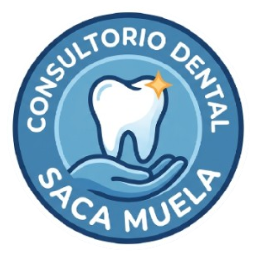

# 💻 Trabajo Final Integrador Primer Cuatrimestre - Sistema de Gestión de Consultorio Odontológico “Saca Muela” 🦷

**Instituto Superior de Formación Técnica Nº 151**   
**Carrera:** Tecnicatura Superior en Análisis de Sistemas  
**Materia:** Algoritmos y Estructuras de Datos II  
**Tema:** Fundamentos generales de Python, SQLite y Tkinter   
**Alumno:** David Hernán Bravo  

---

## 📖 Descripción del Proyecto

Este repositorio contiene el desarrollo integral de una aplicación de escritorio destinada a digitalizar la gestión de pacientes del consultorio odontológico "Saca Muela". El sistema permite administrar un ciclo completo de operaciones CRUD (Alta, Baja, Modificación y Consulta) respaldado por una base de datos relacional local, con un fuerte enfoque en la separación de responsabilidades (Arquitectura de Capas) y la programación defensiva.

El desarrollo está estructurado y documentado en tres entregables principales (Hitos), los cuales detallan el ciclo de vida del software desde su concepción teórica hasta su despliegue final.

---

## 🚀 Evolución y Documentación (Hitos)

Toda la documentación teórica y técnica se encuentra alojada en la carpeta `documentacion/`.

### 📝 [Hito 0: Especificaciones de Requerimientos](documentacion/HITO_0.md)

Define el "contrato" del sistema, estableciendo las bases operativas y restricciones de calidad.

* **Funcionales:** Registro, listado, búsqueda por DNI, modificación y eliminación de pacientes.

* **No Funcionales:** Separación estricta de lógica SQL e interfaz, manejo de excepciones (`try...except`), eficiencia de persistencia sin bloqueos, e interfaz mediante pestañas (`ttk.Notebook`).

* **De Dominio:** Unicidad del DNI (numérico obligatorio) y obligatoriedad del campo teléfono para la gestión de turnos.

### 📊 [Hito 1: Diseño del Sistema (UML)](documentacion/HITO_1.md)

Aborda el modelado estático y de comportamiento del sistema asegurando el desacoplamiento.

* **Diagrama de Casos de Uso:** Mapea las interacciones del personal del consultorio con el CRUD y aísla lógicamente la validación de reglas de negocio.

* **Diagrama de Clases:** Define la estructura de las dos capas fundamentales: `formulario_odontologico` (UI) y `consultorio` (DAO/Persistencia), demostrando una relación unidireccional donde la vista consume los métodos de la base de datos sin inyectar SQL directamente.

### 🛠️ [Hito 2: Codificación y Arquitectura](documentacion/HITO_2.md)

Detalla la implementación técnica, la escalabilidad del código y las pruebas de robustez.

* **Capa de Datos:** Uso de `sqlite3` y `contextlib.closing` para prevenir fugas de memoria y errores de bloqueo en la base de datos.

* **Capa de Presentación:** Uso de `tkinter` y validación temprana (Early Return) para evitar procesamiento innecesario.

* **Entorno:** Aislamiento mediante entornos virtuales (`.venv`), manejo de rutas dinámicas (`sys.frozen`) y automatización del empaquetado del software.

---

## 📂 Estructura de Directorios

El proyecto adopta una estructura modular para evitar el acoplamiento de recursos físicos:

```text
📂 TPF_C1\
├── 📁 assets\
│   ├── 🖼️ saca_muela_fondo.png         # Recursos gráficos (iconos, fondos)
│   ├── 🖼️ saca_muela_icono.ico      
│   └── 🖼️ saca_muela_logo.png
│                         
├── 📁 database\                        # Almacenamiento del estado local
│   └── ⛃ consultorio.db               # Archivo SQLite generado dinámicamente
│                 
├── 📁 diagramas\                       # Modelado UML del sistema (.drawio)
│   
├── 📁 documentacion\                   # Respaldos teóricos de cada fase (.md)
│
├── 📂 src\                             # Código fuente aislado
│   ├── 📘 consultorio.py               # Capa de Datos/SQL (DAO)
│   └── 📘 formulario_odontologico.py   # Capa UI / Main (Tkinter)
│
├── 🗑️ .gitignore                       # Omisión de /venv, /build, /dist y la DB
├── ⚙️ compilame.bat                    # Script de automatización de build
├── 📝 requirements.txt                 # Dependencias externas (Pillow, pyinstaller)
└── 📝 README.md                        # Documentación principal
```
---

## ⚙️ Instalación y Compilación

Para ejecutar o compilar este proyecto localmente, es indispensable aislar el entorno de ejecución.

1. Clonar el repositorio y acceder a la raíz:

    ```text
    git clone <url-del-repositorio>
    cd TPF_C1
    ```
2. Crear y activar el entorno virtual:

    ```text
    python -m venv .venv
    .venv\Scripts\activate
    ```
3. Instalar las dependencias:

    ```text
    pip install -r requirements.txt
    ```
4. Ejecutar en modo desarrollo:
   
    ```text
    python src\formulario_odontologico.py
    ```
5. Compilar el ejecutable de distribución: Asegúrese de tener el entorno .venv activado y simplemente ejecute el archivo de automatización:

    ```text
    compilame.bat
    ```
    Este script limpiará builds anteriores, invocaré a PyInstaller inyectando los assets y generará un binario nativo SacaMuela.exe en la raíz del proyecto.